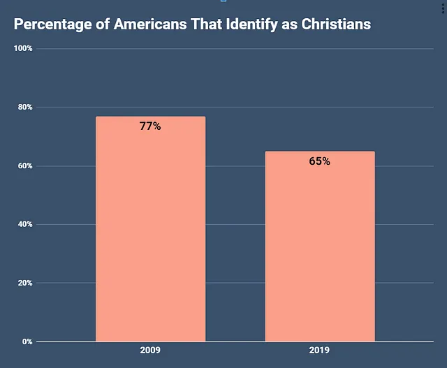
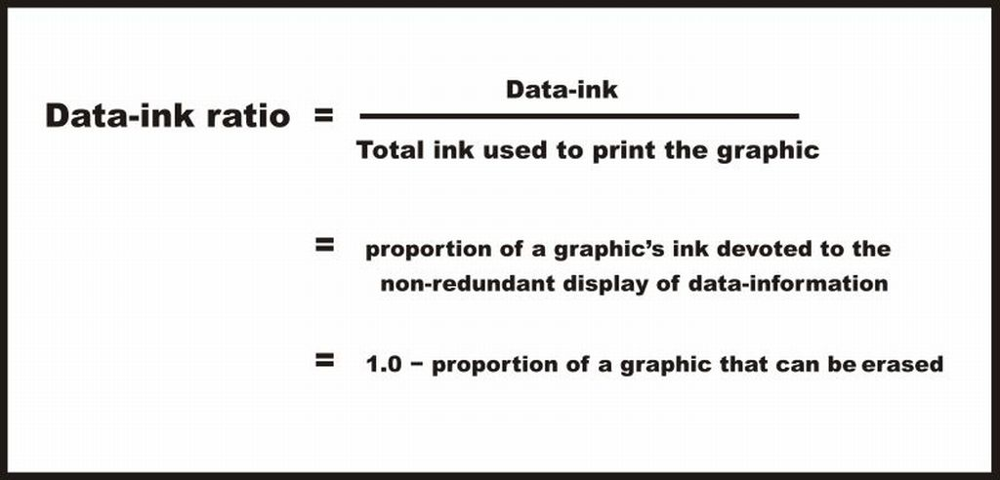

```{r setup, include=FALSE}
knitr::opts_chunk$set(warning = F, cache = F, message = F, dpi = 300)
options(htmltools.dir.version = FALSE)
library(xaringanthemer)
library(magrittr)
library(flair)
library(tidyverse)
library(learningtower)
# xaringan::inf_mr()

data(student_subset_2018)
```

```{r xaringan-themer, include=FALSE, warning=FALSE}
style_mono_accent(
  base_color = "black",
  text_color = "white",
  white_color = "#F8B500",
  background_color = "black",
  header_color = "#D68C11",
  link_color = "#D68C11",
  text_bold_color = "#D68C11",
  code_inline_color = "#D68C11",
  header_font_google = google_font("Josefin Sans"),
  text_font_google   = google_font("Montserrat", "300", "300i"),
  code_font_google   = google_font("Fira Mono")
)
```

<style>
:root {
  --font12: 12pt;
  --font10: 10pt;
  --font8: 8pt;
}

.font12 > table {
  font-size: var(--font12);
}

.font12 > p {
  font-size: var(--font12);
}

.font12 > pre .remark-code-line {
  font-size: var(--font12);
}

.font10 > table {
  font-size: var(--font10);
}

.font10 > p {
  font-size: var(--font10);
}

.font10 > pre .remark-code-line {
  font-size: var(--font10);
}

.font8 > table {
  font-size: var(--font8);
}

.font8 > p {
  font-size: var(--font8);
}

.font8 > pre .remark-code-line {
  font-size: var(--font8);
}

.aligncenter {
    text-align: center;
}

</style>

# How to lie with your graph?

1. Trick the aspect ratio

2. Play with the axis

3. Muddy the plot

---
class: middle, center

# 1. Trick the aspect ratio

---

# What story does this tell?

.pull-left[
```{r, eval = F}
# Load PISA 2018 data

library(learningtower)
data(student_subset_2018)

# Plot the relationship between
# math score and family wealth 
# (r = 0.31)

ggplot(student_subset_2018,
       aes(x = math, y = wealth)) +
  geom_point() + 
  geom_smooth(method = "lm") + 
  theme_bw() +
  labs(x = "PISA Math Score",
       y = "Family Wealth")
```
]

.pull-right[
```{r, echo = F}
data(student_subset_2018)

# Plot the relationship between
# math score and family wealth (r = 0.31)

ggplot(student_subset_2018,
       aes(x = math, y = wealth)) +
  geom_point() + 
  geom_smooth(method = "lm") + 
  theme_bw() +
  labs(x = "PISA Math Score",
       y = "Family Wealth")
```
]

---

# What about this one?

.pull-left[
```{r, eval = F}
# Load PISA 2018 data

library(learningtower)
data(student_subset_2018)

# Plot the relationship between
# math score and family wealth 
# (r = 0.31)

ggplot(student_subset_2018,
       aes(x = math, y = wealth)) +
  geom_point() + 
  geom_smooth(method = "lm") + 
  theme_bw() +
  labs(x = "PISA Math Score",
       y = "Family Wealth")
```
]

.pull-right[
```{r, echo = F, fig.height=3,fig.align='center'}
# Plot the relationship between
# math score and family wealth 
# (r = 0.31)

ggplot(student_subset_2018,
       aes(x = math, y = wealth)) +
  geom_point() + 
  geom_smooth(method = "lm") + 
  theme_bw() +
  labs(x = "PISA Math Score",
       y = "Family Wealth")
```
]

---

# What about this one?

.pull-left[
```{r, eval = F}
# Load PISA 2018 data

library(learningtower)
data(student_subset_2018)

# Plot the relationship between
# math score and family wealth 
# (r = 0.31)

ggplot(student_subset_2018,
       aes(x = math, y = wealth)) +
  geom_point() + 
  geom_smooth(method = "lm") + 
  theme_bw() +
  labs(x = "PISA Math Score",
       y = "Family Wealth")
```
]

.pull-right[
```{r, echo = F, fig.align='center', fig.height = 4, fig.width=2, dpi = 100}
# Plot the relationship between
# math score and family wealth 
# (r = 0.31)

ggplot(student_subset_2018,
       aes(x = math, y = wealth)) +
  geom_point() + 
  geom_smooth(method = "lm") + 
  theme_bw() +
  labs(x = "PISA Math Score",
       y = "Family Wealth") +
  theme(axis.title.x = element_text(size = 8),
        axis.title.y = element_text(size = 8),
        axis.text.x = element_text(size = 6),
        plot.title = element_text(size = 5, hjust = 0.5),
        strip.text = element_text(size = 5),
        plot.margin = margin(t = 10, r = 10, b = 10, l = 10))
```
]

---

## Solution: Banking to a "good" degree

.aligncenter[

]

.font10[

Source: https://eagereyes.org/blog/2013/banking-45-degrees

Cleveland, W. S., McGill, M. E., & McGill, R. (1988). The shape parameter of a two-variable graph. Journal of the American Statistical Association, 83(402), 289-300.
]

---

class: middle, center

# 2. Play with the axis

---

# What story does this tell?

.pull-left[
```{r, eval = F}
# Group by 'book' and calculate the mean reading score for each category
df <- student_subset_2018 %>%
  group_by(gender) %>%
  summarise(mean_read = mean(read, 
                             na.rm = TRUE)) %>% 
  na.omit()

# Create the bar plot
ggplot(df, aes(x = gender, 
               y = mean_read)) +
  geom_bar(stat = "identity", 
           fill = "skyblue") +
  labs(title = "Average Reading Score by Gender",
       x = "Gender",
       y = "Average Reading Score") +
  theme_minimal()
```
]

.pull-right[
```{r, echo = F}
# Group by 'book' and calculate the mean reading score for each category
df <- student_subset_2018 %>%
  group_by(gender) %>%
  summarise(mean_read = mean(read, 
                             na.rm = TRUE)) %>% 
  na.omit()

# Create the bar plot
ggplot(df, aes(x = gender, 
               y = mean_read)) +
  geom_bar(stat = "identity", 
           fill = "skyblue") +
  labs(title = "Average Reading Score by Gender",
       x = "Gender",
       y = "Average Reading Score") +
  theme_minimal()
```
]

---

# What about this one?

.pull-left[
```{r, eval = F}
# Create the bar plot
ggplot(df, aes(x = gender, 
               y = mean_read)) +
  geom_bar(stat = "identity", 
           fill = "skyblue") +
  labs(title = "Average Reading Score by Gender",
       x = "Gender",
       y = "Average Reading Score") +
  coord_cartesian(ylim=c(420, 500)) + # change the axis range
  theme_minimal()
```
]

.pull-right[
```{r, echo = F}
# Create the bar plot
ggplot(df, aes(x = gender, 
               y = mean_read)) +
  geom_bar(stat = "identity", 
           fill = "skyblue") +
  labs(title = "Average Reading Score by Gender",
       x = "Gender",
       y = "Average Reading Score") +
  coord_cartesian(ylim=c(420, 500)) + # change the axis range
  theme_minimal()
```
]

---

# What about this one?

.pull-left[
```{r, eval = F}
# Create the bar plot
ggplot(df, aes(x = gender, 
               y = mean_read)) +
  geom_bar(stat = "identity", 
           fill = "skyblue") +
  labs(title = "Average Reading Score by Gender",
       x = "Gender",
       y = "Average Reading Score") +
  coord_cartesian(ylim=c(0, 10000)) + # change the axis range
  theme_minimal()
```
]

.pull-right[
```{r, echo = F}
# Create the bar plot
ggplot(df, aes(x = gender, 
               y = mean_read)) +
  geom_bar(stat = "identity", 
           fill = "skyblue") +
  labs(title = "Average Reading Score by Gender",
       x = "Gender",
       y = "Average Reading Score") +
  coord_cartesian(ylim=c(0, 10000)) + # change the axis range
  theme_minimal()
```
]

---

## This is more common than you think!

.aligncenter[

]

.font10[

Source: https://www.heap.io/blog/how-to-lie-with-data-visualization
]

---

## Another "good" one!

.aligncenter[

]

.font10[

Source: https://medium.com/@thomas.ellyatt/bad-data-visualisation-real-life-examples-out-there-in-the-wild-eb5032329aeb
]

---

## Solution: Be honest and informative!

.aligncenter[

]

Source: https://medium.com/@thomas.ellyatt/bad-data-visualisation-real-life-examples-out-there-in-the-wild-eb5032329aeb
]

---

class: middle, center

# 3. Muddy the plot

---

# What story does this tell?

`facet_wrap(~country)`:

```{r, echo = F, dpi = 300, fig.height=4, fit.width=8}
# relationship between reading & wealth
# by country

ggplot(student_subset_2018,
       aes(x = math, y = wealth)) +
  geom_point() + 
  geom_smooth(method = "lm", fill = NA) + 
  facet_wrap(~country, nrow = 4) +
  theme_bw() +
  labs(x = "PISA Math Score",
       y = "Family Wealth") +
  theme(axis.text.x = element_text(size = 3),
        plot.title = element_text(size = 5, hjust = 0.5),
        strip.text = element_text(size = 5),
        plot.margin = margin(t = 20, r = 20, b = 20, l = 20))
```

---

# What about this?

`aes(x = math, y = wealth, color = country)`:

```{r, echo = F, dpi = 300, fig.height=4, fit.width=5}
# relationship between reading & wealth
# colored by number of books at home

ggplot(student_subset_2018,
       aes(x = math, y = wealth, color = country)) +
  geom_point() + 
  geom_smooth(method = "lm", fill = NA) + 
  theme_bw() +
  labs(x = "PISA Math Score",
       y = "Family Wealth")
```

---

## Solution: Think about data-ink ratio!

.aligncenter[

]

.font10[
Source: https://infovis-wiki.net/wiki/Data-Ink_Ratio
]

---

class: middle, center

# Thank you!

.aligncenter[

]
