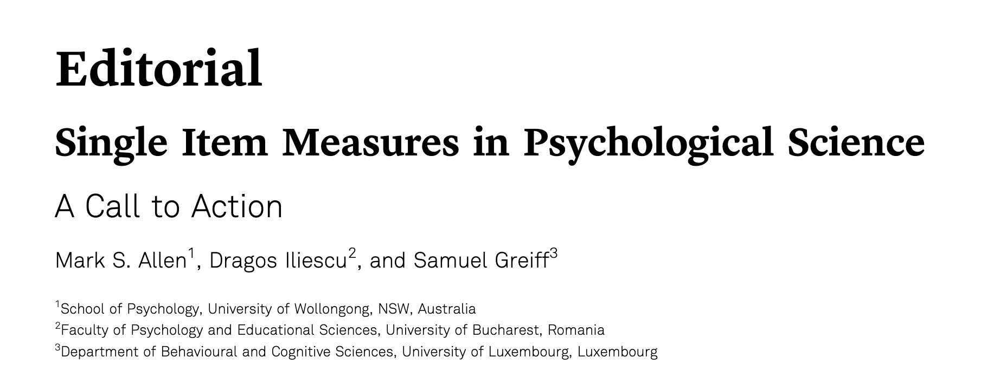
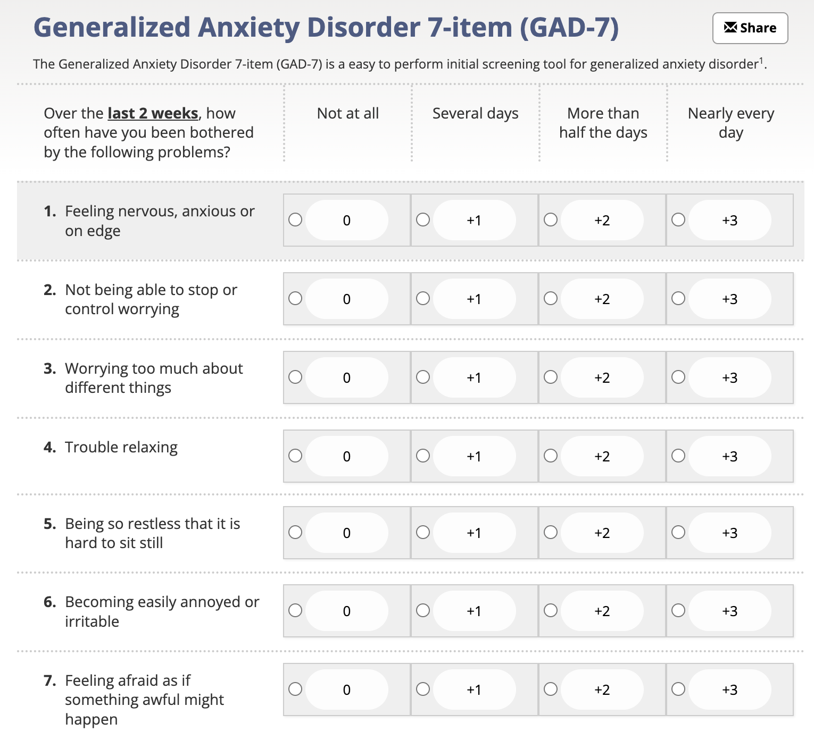

```{r setup, include=FALSE}
knitr::opts_chunk$set(warning = F, cache = F, message = F, dpi = 300)
options(htmltools.dir.version = FALSE)
library(xaringanthemer)
library(magrittr)
library(flair)
library(tidyverse)
# xaringan::inf_mr()
```

```{r xaringan-themer, include=FALSE, warning=FALSE}
style_mono_accent(
  base_color = "black",
  text_color = "white",
  white_color = "#F8B500",
  background_color = "black",
  header_color = "#D68C11",
  link_color = "#D68C11",
  text_bold_color = "#D68C11",
  code_inline_color = "#D68C11",
  header_font_google = google_font("Josefin Sans"),
  text_font_google   = google_font("Montserrat", "300", "300i"),
  code_font_google   = google_font("Fira Mono")
)
```

<style>
:root {
  --font12: 12pt;
  --font10: 10pt;
  --font8: 8pt;
}

.font12 > table {
  font-size: var(--font12);
}

.font12 > p {
  font-size: var(--font12);
}

.font12 > pre .remark-code-line {
  font-size: var(--font12);
}

.font10 > table {
  font-size: var(--font10);
}

.font10 > p {
  font-size: var(--font10);
}

.font10 > pre .remark-code-line {
  font-size: var(--font10);
}

.font8 > table {
  font-size: var(--font8);
}

.font8 > p {
  font-size: var(--font8);
}

.font8 > pre .remark-code-line {
  font-size: var(--font8);
}

.aligncenter {
    text-align: center;
}

</style>


# Key takeaways

1. Single-item measures are not inherently inferior.

2. They can be viable, especially for constructs that are unidimensional and narrow in scope.

3. Proper validation is needed.

.aligncenter[

]

.font10[

Source: https://econtent.hogrefe.com/doi/epdf/10.1027/1015-5759/a000699

Allen, M. S., Iliescu, D., & Greiff, S. (2022). Single item measures in psychological science. *European Journal of Psychological Assessment*.
]

---

class: middle, center

# Is this this a good measure?

.aligncenter[

### "How anxious do you feel right now?"

*1 = Not at all anxious → 7 = Extremely anxious*
]

---

# Or is this better?

.aligncenter[

]

---

class: middle, center

# Well, it depends.

###  It depends on how you define the construct "Anxiety".

For example, a person might report being anxious to mean they are excited and experiencing a state of readiness for an upcoming competition. 

To capture a more rounded interpretation of a person’s emotional state, multiple items using a variety of terms (e.g., worried, concerned, nervous, frightened, uneasy, apprehensive) might be a better approach to capturing the breadth of the emotion.

---
## Arguments For Single-Item Measures

### Efficiency and Utility:
  - Ideal for large panel surveys and time-restricted conditions.
  
  - More suitable for vulnerable populations (e.g., clinical patients) who may struggle with longer measures.
  
### Simplicity:
  - Can be more satisfying for respondents, reducing frustration from repetitive questions.
  
  - Decreases data processing costs, especially in large-scale studies.
  
---

## Arguments Against Single-Item Measures

### Reliability Concerns:
  - Without multiple items, internal consistency cannot be assessed (Fuchs & Diamantopoulos, 2009).
  
  - **Spearman-Brown prophecy**: Multi-item scales reduce measurement error through item averaging.
  
### Content Validity Issues:
  - Single items might not capture complex constructs with multidimensional content.

---

## Validating Single-Item Measures

### Convergent Validity:
  - Single-item measures often correlate well with their multi-item counterparts (e.g., life satisfaction measures, r = .64) (Cheung & Lucas, 2014).
  
### Test-Retest Reliability:
  - Stable constructs (e.g., attitudes) show acceptable test-retest correlations (ranging from .46 to .78) (Fisher et al., 2016).

---

class: middle, center

# Thank you!

.aligncenter[

]
